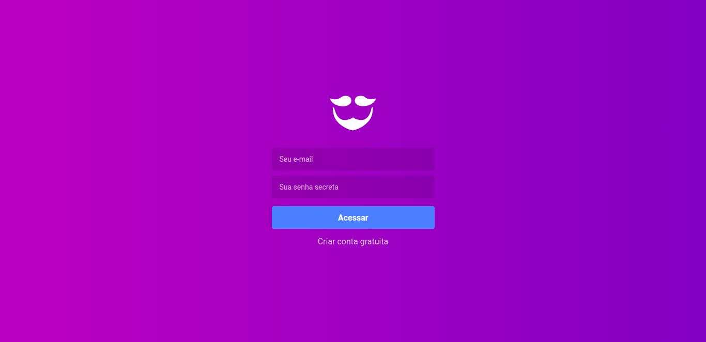
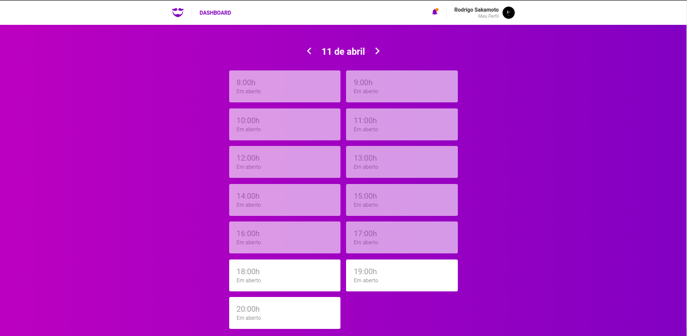
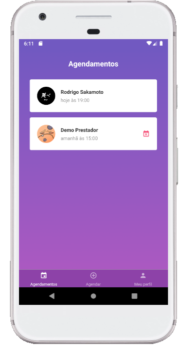
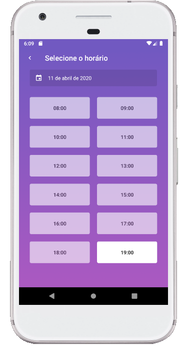

<h1 align="center" >
  
</h1>

<h2>GoBarber</h2>

## Web 💻




## Mobile📱

<h2>



</h2>


## 💾 Instalação

<h3> Instalação - Backend</h3>

<h4>1. Configurando Docker</h4>

 - Crie um database PostgresSQL, MongoDB e redis
 - Crie um arquivo .env seguindo o formato do .env.example


<h4>2. Execute os comandos abaixo</h4>

```bash
# Clone o repositório
$ git clone https://github.com/rodrigosakamoto/GoStack-GoBarber.git

# Em seguida execute:

$ cd GoStack-GoBarber
$ cd backend

$ yarn

$ yarn sequelize db:migrate

$ yarn dev
$ yarn queue
```

<h3> Instalação - Frontend 💻 </h3>

<h4>Execute os comandos abaixo</h4>

```bash
$ cd GoStack-GoBarber
$ cd web

# Em seguida execute:

$ yarn

$ yarn start
```


<h3> Instalação - Mobile 📱(Android) </h3>

<h4>Execute os comandos abaixo</h4>

```bash
$ cd GoStack-GoBarber
$ cd mobile
# Em seguida execute:

$ yarn

$ react-native run android
$ yarn start
```
